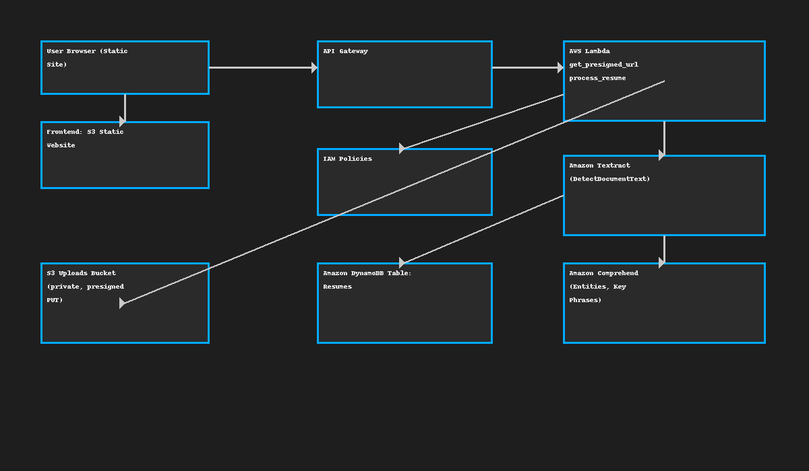

# aws-resume-screening-setup

# AI-Powered Resume Screening (AWS Free Tier)

A serverless web app that extracts text from resumes (OCR with Amazon Textract), detects entities/phrases (Amazon Comprehend), tags common tech skills, and (optionally) computes a match score against a pasted job description.

> **Tech**: S3 (static hosting + uploads), API Gateway, Lambda (Python), DynamoDB, Textract, Comprehend, IAM, CloudWatch  
> **Cost**: Designed for AWS Free Tier. Always set **budgets/alerts** and clean up after testing.

---

## Architecture



**Flow**
1. Frontend (S3 static site) requests a **presigned PUT URL** from API Gateway → Lambda (`get_presigned_url`).
2. Browser uploads the resume file directly to a **private S3 uploads bucket** using the presigned URL.
3. Frontend calls a second API (`/upload`) → Lambda (`process_resume`) which:
   - Calls **Textract** to OCR the resume (image formats for this demo).
   - Calls **Comprehend** to extract **entities** and **key phrases**.
   - Tags **common tech skills**.
   - Optionally computes a **match score** vs a provided job description.
   - Stores a compact result item in **DynamoDB**.
4. Frontend displays the result with tags + match score and shows raw JSON.

---

## Prerequisites
- AWS Account (Free Tier)
- Region: choose one where **Textract** and **Comprehend** are available (e.g., `ap-south-1` / `us-east-1`)
- Create a **billing budget + alert** first (recommended).

---

## 1) Create S3 buckets

### A. Frontend site bucket
1. Open **S3** → **Create bucket**  
   - Name: `resume-screening-frontend-<your-unique-suffix>`  
   - Region: your chosen region  
   - Uncheck **Block all public access** (for static website hosting) → acknowledge warning  
2. Open the bucket → **Properties** → **Static website hosting** → **Enable**  
   - Index document: `index.html`
3. **Permissions** → **Bucket policy**: paste the policy below (replace the bucket name)
```json
{
  "Version": "2012-10-17",
  "Statement": [
    {
      "Sid": "PublicReadGetObject",
      "Effect": "Allow",
      "Principal": "*",
      "Action": ["s3:GetObject"],
      "Resource": ["arn:aws:s3:::resume-screening-frontend-<your-unique-suffix>/*"]
    }
  ]
}
```
4. Upload files from `frontend/` (`index.html`, `style.css`, `app.js`).  
5. Copy the **static website endpoint URL** (shown in Properties).

### B. Private uploads bucket
1. Create another bucket: `resume-screening-uploads-<your-unique-suffix>`  
2. Keep **Block all public access** **ON** (private).  
3. Configure **CORS** (Permissions → CORS) so your website can PUT files from the browser. Replace `https://<YOUR-WEBSITE-ENDPOINT>` with your site URL.
```xml
<CORSConfiguration>
  <CORSRule>
    <AllowedOrigin>https://<YOUR-WEBSITE-ENDPOINT></AllowedOrigin>
    <AllowedMethod>PUT</AllowedMethod>
    <AllowedMethod>GET</AllowedMethod>
    <AllowedMethod>HEAD</AllowedMethod>
    <AllowedHeader>*</AllowedHeader>
    <ExposeHeader>ETag</ExposeHeader>
  </CORSRule>
</CORSConfiguration>
```

---

## 2) Create DynamoDB table
- Table name: **Resumes**  
- Partition key: **resumeId** (String)  
- Capacity mode: **Provisioned**  
  - Read capacity units: **1**  
  - Write capacity units: **1** (keeps you comfortably in Free Tier)

---

## 3) Create an IAM role for Lambda
Create a role named **`ResumeAppLambdaRole`** with **trusted entity = Lambda** and attach these policies (scope to your resources when possible):

**Inline policy example (replace ARNs and region):**
```json
{
  "Version": "2012-10-17",
  "Statement": [
    {
      "Sid": "S3AccessForUploadAndRead",
      "Effect": "Allow",
      "Action": ["s3:PutObject","s3:GetObject"],
      "Resource": ["arn:aws:s3:::resume-screening-uploads-<your-unique-suffix>/*"]
    },
    {
      "Sid": "TextractBasic",
      "Effect": "Allow",
      "Action": ["textract:DetectDocumentText"],
      "Resource": "*"
    },
    {
      "Sid": "ComprehendBasic",
      "Effect": "Allow",
      "Action": ["comprehend:DetectEntities","comprehend:DetectKeyPhrases"],
      "Resource": "*"
    },
    {
      "Sid": "DynamoDBWrite",
      "Effect": "Allow",
      "Action": ["dynamodb:PutItem","dynamodb:UpdateItem"],
      "Resource": "arn:aws:dynamodb:<region>:<account-id>:table/Resumes"
    },
    {
      "Sid": "Logs",
      "Effect": "Allow",
      "Action": ["logs:CreateLogGroup","logs:CreateLogStream","logs:PutLogEvents"],
      "Resource": "*"
    }
  ]
}
```

> Note: `s3:PutObject` permission is required on the role that signs presigned URLs so the PUT succeeds.

---

## 4) Create Lambda functions

Create **two** Lambda functions using **Python 3.11** runtime and the role `ResumeAppLambdaRole`:

### A. `get_presigned_url`
- Upload `backend/get_presigned_url.py` as the handler (`get_presigned_url.lambda_handler`).
- Environment variables:
  - `UPLOAD_BUCKET = resume-screening-uploads-<your-unique-suffix>`
  - `ALLOWED_ORIGIN = https://<YOUR-WEBSITE-ENDPOINT>`

### B. `process_resume`
- Upload `backend/process_resume.py` as the handler (`process_resume.lambda_handler`).
- Environment variables:
  - `TABLE_NAME = Resumes`
  - `ALLOWED_ORIGIN = https://<YOUR-WEBSITE-ENDPOINT>`
  - (AWS sets region automatically)

> For the demo, the Lambda processes **JPG/PNG/TIFF**. See the **PDF note** below.

---

## 5) Create API Gateway (REST)

Create a **REST API** with two resources/methods (use *ANY* or specifically **POST**):

1. **`/getPresignedUrl`** → Integration: **Lambda proxy** → `get_presigned_url`
2. **`/upload`** → Integration: **Lambda proxy** → `process_resume`

Enable **CORS** for both resources and **Deploy API** (e.g., Stage = `prod`).  
Copy the **Invoke URL** and set it in `frontend/app.js`:
```js
const API_URL = "https://<api-id>.execute-api.<region>.amazonaws.com/prod";
```

---

## 6) Update frontend & test
1. Open `frontend/app.js` and set `API_URL`.  
2. Re-upload `index.html`, `style.css`, `app.js` to your site bucket.  
3. Open the website URL, upload a **JPG/PNG** resume, and optionally paste a job description.  
4. You should see **skills tags** and a **match score** (if JD provided), with raw JSON underneath.

---

## PDF support (optional upgrade)
Textract synchronous `DetectDocumentText` works best with **images** for quick demos.  
To support **PDFs**, switch to **asynchronous** Textract (`StartDocumentTextDetection`) and poll `GetDocumentTextDetection`, or use **SNS/SQS** to complete out-of-band. This is a good “Phase 2” enhancement and is interview-friendly to discuss.

---

## Security & cost tips
- Keep the uploads bucket **private** and only allow browser access via **presigned URLs**.
- Scope IAM permissions to specific ARNs (no `*` in production).
- DynamoDB with `1/1` RCUs/WCUs is sufficient for demos.
- Set a **budget alarm** and **delete resources** when done.

---

## Cleanup
- Delete the API, Lambdas, DynamoDB table, and both S3 buckets to stop all charges.

---

## Project status badges for your README
- ✅ Serverless on AWS (Free Tier)
- ✅ OCR + NLP pipeline (Textract + Comprehend)
- ✅ Skill tagging + match score
- ✅ Clean dark UI (mobile friendly)
- ✅ Deployed via S3 + API Gateway + Lambda + DynamoDB

---

## License
MIT
